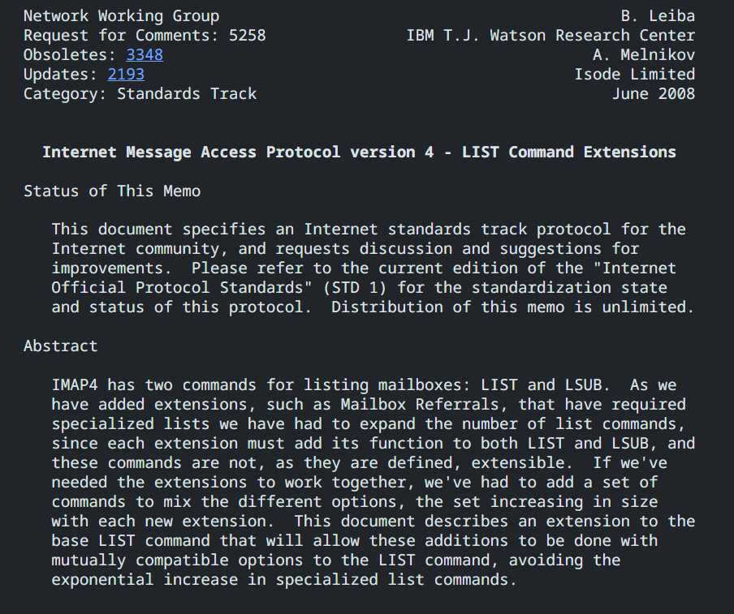

Using the sockets API, create an IMAP client part of the protocol.
Regarding the client for testing: it is (almost) always possible to download a good "server" or "client" for demonstration purposes.

I will use C language.

----------------------------------------

cd /mnt/c/Users/ramun/Desktop/netw/IMAP_client

gcc -o imap_client imap_client.c
./imap_client

----------------------------------------

Is Dovecot running?
sudo systemctl status dovecot

Start Dovecot:
sudo systemctl start dovecot

Confirm that server is listening: 
ss -tlnp | grep 143

Restart DoveCot:
sudo systemctl restart dovecot

----------------------------------------

testuser abc

- Running the Dovecot IMAP server locally

A001 LOGIN testuser password
